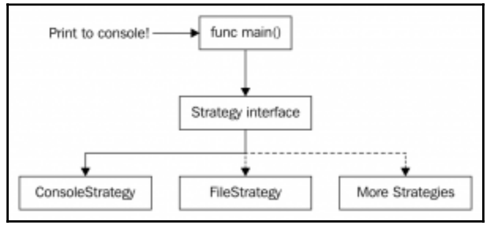

Strategy
========

Шаблон Strategy относится к поведенческим паттернам уровня объекта. Поведенческие паттерны инкапсулируют поведение.

Паттерн Стратегия определяет семейство алгоритмов, схожих по роду деятельности, инкапсулирует каждый из них и обеспечивает их взаимозаменяемость. Он позволяет модифицировать алгоритмы независимо от их использования на стороне клиента. 

Цели Стратегии:

-Предоставить нескольким алгоритмам получение определенного функционала;
-Все типы получают схожий функционал разными путями, но клиент стратегии не затрагивается;
-Применять разные варианты алгоритма внутри одного объекта;

+:
-Замена алгоритмов на лету;
-Изоляция кода алгоритмов от остальных объектов бизнес-логики;

-:
-Усложнение программы;
-Клиент должен знать разницу между стратегиями;

